# A+ Content Examples
This document contains examples that can help you create A+ content pages. There are two parts to this document:

-   [Content document example](#Content-document-example): A rendered example of a content document, with example code.

-   [Content module examples](#content-module-examples): Examples of available content module types, including mappings of editor fields and JSON properties.

## Content document example
**Rendered example**

This content document has the following module order: StandardFourImageTextModule, StandardTextModule, StandardFourImageTextQuadrantModule, StandardTechSpecsModule, StandardComparisonTableModule

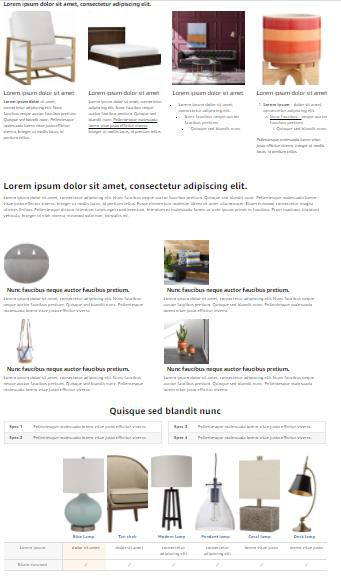

 **Code example**
 ```
{
  "contentDocument": {
    "name": "Content document example",
    "contentType": "EMC",
    "contentSubType": null,
    "locale": "en-US",
    "contentModuleList": [
    {
        "contentModuleType": "STANDARD_FOUR_IMAGE_TEXT",
        "standardCompanyLogo": null,
        "standardComparisonTable": null,
        "standardFourImageText": {
          "headline": {
            "value": "Lorem ipsum dolor sit amet, consectetur adipiscing elit.",
            "decoratorSet": []
          },
          "block1": {
            "headline": {
              "value": "Lorem ipsum dolor sit amet",
              "decoratorSet": []
            },
            "body": {
              "textList": [
              {
                  "value": "Lorem ipsum dolor sit amet, consectetur adipiscing elit. Nunc faucibus neque auctor faucibus pretium. Quisque sed blandit nunc. Pellentesque malesuada lorem vitae justo efficitur viverra. Integer ut mollis lacus, id pretium tellus.",
                  "decoratorSet": [
                  {
                      "type": "STYLE_BOLD",
                      "offset": 0,
                      "length": 18,
                      "depth": 0
                    }, {
                      "type": "STYLE_BOLD",
                      "offset": 56,
                      "length": 1,
                      "depth": 0
                    }, {
                      "type": "STYLE_ITALIC",
                      "offset": 102,
                      "length": 26,
                      "depth": 0
                    }
                  ]
                }
              ]
            }
          },
          "block2": {
            "headline": {
              "value": "Lorem ipsum dolor sit amet",
              "decoratorSet": []
            },
            "body": {
              "textList": [
              {
                  "value": "Lorem ipsum dolor sit amet, consectetur adipiscing elit. Nunc faucibus neque auctor faucibus pretium. Quisque sed blandit nunc. Pellentesque malesuada lorem vitae justo efficitur viverra. Integer ut mollis lacus, id pretium tellus.",
                  "decoratorSet": [
                  {
                      "type": "STYLE_UNDERLINE",
                      "offset": 128,
                      "length": 58,
                      "depth": 0
                    }
                  ]
                }
              ]
            }
          },
          "block3": {
            "headline": {
              "value": "Lorem ipsum dolor sit amet",
              "decoratorSet": []
            },
            "body": {
              "textList": [
              {
                  "value": "Lorem ipsum dolor sit amet, consectetur adipiscing elit. Nunc faucibus neque auctor faucibus pretium. Quisque sed blandit nunc.",
                  "decoratorSet": [
                  {
                      "type": "LIST_UNORDERED",
                      "offset": 57,
                      "length": 70,
                      "depth": 1
                    }, {
                      "type": "LIST_ITEM",
                      "offset": 57,
                      "length": 70,
                      "depth": 1
                    }, {
                      "type": "LIST_ITEM",
                      "offset": 102,
                      "length": 25,
                      "depth": 2
                    }, {
                      "type": "LIST_UNORDERED",
                      "offset": 102,
                      "length": 25,
                      "depth": 2
                    }, {
                      "type": "LIST_ITEM",
                      "offset": 0,
                      "length": 127,
                      "depth": 0
                    }, {
                      "type": "LIST_UNORDERED",
                      "offset": 0,
                      "length": 127,
                      "depth": 0
                    }
                  ]
                }
              ]
            }
          },
          "block4": {
            "headline": {
              "value": "Lorem ipsum dolor sit amet",
              "decoratorSet": []
            },
            "body": {
              "textList": [
              {
                  "value": "Lorem ipsum - dolor sit amet, consectetur adipiscing elit. Nunc faucibus - neque auctor faucibus pretium. Quisque sed blandit nunc.",
                  "decoratorSet": [
                  {
                      "type": "LIST_ORDERED",
                      "offset": 59,
                      "length": 72,
                      "depth": 1
                    }, {
                      "type": "STYLE_UNDERLINE",
                      "offset": 59,
                      "length": 16,
                      "depth": 0
                    }, {
                      "type": "LIST_ITEM",
                      "offset": 106,
                      "length": 25,
                      "depth": 2
                    }, {
                      "type": "LIST_ORDERED",
                      "offset": 0,
                      "length": 131,
                      "depth": 0
                    }, {
                      "type": "LIST_ITEM",
                      "offset": 59,
                      "length": 72,
                      "depth": 1
                    }, {
                      "type": "LIST_ITEM",
                      "offset": 0,
                      "length": 131,
                      "depth": 0
                    }, {
                      "type": "STYLE_BOLD",
                      "offset": 0,
                      "length": 13,
                      "depth": 0
                    }, {
                      "type": "LIST_ORDERED",
                      "offset": 106,
                      "length": 25,
                      "depth": 2
                    }
                  ]
                }, {
                  "value": "Pellentesque malesuada lorem vitae justo efficitur viverra. Integer ut mollis lacus, id pretium tellus.",
                  "decoratorSet": [
                  {
                      "type": "STYLE_ITALIC",
                      "offset": 0,
                      "length": 103,
                      "depth": 0
                    }
                  ]
                }
              ]
            }
          }
        },
        "standardFourImageTextQuadrant": null,
        "standardHeaderImageText": null,
        "standardImageSidebar": null,
        "standardImageTextOverlay": null,
        "standardMultipleImageText": null,
        "standardProductDescription": null,
        "standardSingleImageHighlights": null,
        "standardSingleImageSpecsDetail": null,
        "standardSingleSideImage": null,
        "standardTechSpecs": null,
        "standardText": null,
        "standardThreeImageText": null
      }, {
        "contentModuleType": "STANDARD_TEXT",
        "standardCompanyLogo": null,
        "standardComparisonTable": null,
        "standardFourImageText": null,
        "standardFourImageTextQuadrant": null,
        "standardHeaderImageText": null,
        "standardImageSidebar": null,
        "standardImageTextOverlay": null,
        "standardMultipleImageText": null,
        "standardProductDescription": null,
        "standardSingleImageHighlights": null,
        "standardSingleImageSpecsDetail": null,
        "standardSingleSideImage": null,
        "standardTechSpecs": null,
        "standardText": {
          "headline": {
            "value": "Lorem ipsum dolor sit amet, consectetur adipiscing elit.",
            "decoratorSet": []
          },
          "body": {
            "textList": [
            {
                "value": "Lorem ipsum dolor sit amet, consectetur adipiscing elit. Nunc faucibus neque auctor faucibus pretium. Quisque sed blandit nunc. Pellentesque malesuada lorem vitae justo efficitur viverra. Integer ut mollis lacus, id pretium tellus. Fusce elementum molestie libero sit amet ullamcorper. Etiam euismod consectetur magna ultrices finibus. Pellentesque dictum interdum turpis eget condimentum. Interdum et malesuada fames ac ante ipsum primis in faucibus. Proin maximus tincidunt vehicula. Integer id nibh viverra, euismod odio non, convallis mi.",
                "decoratorSet": []
              }
            ]
          }
        },
        "standardThreeImageText": null
      }, {
        "contentModuleType": "STANDARD_FOUR_IMAGE_TEXT_QUADRANT",
        "standardCompanyLogo": null,
        "standardComparisonTable": null,
        "standardFourImageText": null,
        "standardFourImageTextQuadrant": {
          "block1": {
            "headline": {
              "value": "Nunc faucibus neque auctor faucibus pretium.",
              "decoratorSet": []
            },
            "body": {
              "textList": [
              {
                  "value": "Lorem ipsum dolor sit amet, consectetur adipiscing elit. Nunc faucibus neque auctor faucibus pretium. Quisque sed blandit nunc. Pellentesque malesuada lorem vitae justo efficitur viverra.",
                  "decoratorSet": []
                }
              ]
            }
          },
          "block2": {
            "headline": {
              "value": "Nunc faucibus neque auctor faucibus pretium.",
              "decoratorSet": []
            },
            "body": {
              "textList": [
              {
                  "value": "Lorem ipsum dolor sit amet, consectetur adipiscing elit. Nunc faucibus neque auctor faucibus pretium. Quisque sed blandit nunc. Pellentesque malesuada lorem vitae justo efficitur viverra.",
                  "decoratorSet": []
                }
              ]
            }
          },
          "block3": {
            "headline": {
              "value": "Nunc faucibus neque auctor faucibus pretium.",
              "decoratorSet": []
            },
            "body": {
              "textList": [
              {
                  "value": "Lorem ipsum dolor sit amet, consectetur adipiscing elit. Nunc faucibus neque auctor faucibus pretium. Quisque sed blandit nunc. Pellentesque malesuada lorem vitae justo efficitur viverra.",
                  "decoratorSet": []
                }
              ]
            }
          },
          "block4": {
            "headline": {
              "value": "Nunc faucibus neque auctor faucibus pretium.",
              "decoratorSet": []
            },
            "body": {
              "textList": [
              {
                  "value": "Lorem ipsum dolor sit amet, consectetur adipiscing elit. Nunc faucibus neque auctor faucibus pretium. Quisque sed blandit nunc. Pellentesque malesuada lorem vitae justo efficitur viverra.",
                  "decoratorSet": []
                }
              ]
            }
          }
        },
        "standardHeaderImageText": null,
        "standardImageSidebar": null,
        "standardImageTextOverlay": null,
        "standardMultipleImageText": null,
        "standardProductDescription": null,
        "standardSingleImageHighlights": null,
        "standardSingleImageSpecsDetail": null,
        "standardSingleSideImage": null,
        "standardTechSpecs": null,
        "standardText": null,
        "standardThreeImageText": null
      }, {
        "contentModuleType": "STANDARD_TECH_SPECS",
        "standardCompanyLogo": null,
        "standardComparisonTable": null,
        "standardFourImageText": null,
        "standardFourImageTextQuadrant": null,
        "standardHeaderImageText": null,
        "standardImageSidebar": null,
        "standardImageTextOverlay": null,
        "standardMultipleImageText": null,
        "standardProductDescription": null,
        "standardSingleImageHighlights": null,
        "standardSingleImageSpecsDetail": null,
        "standardSingleSideImage": null,
        "standardTechSpecs": {
          "headline": {
            "value": "Quisque sed blandit nunc",
            "decoratorSet": []
          },
          "specificationList": [
          {
              "label": {
                "value": "Spec 1",
                "decoratorSet": []
              },
              "description": {
                "value": "Pellentesque malesuada lorem vitae justo efficitur viverra. ",
                "decoratorSet": []
              }
            }, {
              "label": {
                "value": "Spec 2",
                "decoratorSet": []
              },
              "description": {
                "value": "Pellentesque malesuada lorem vitae justo efficitur viverra. ",
                "decoratorSet": []
              }
            }, {
              "label": {
                "value": "Spec 3",
                "decoratorSet": []
              },
              "description": {
                "value": "Pellentesque malesuada lorem vitae justo efficitur viverra. ",
                "decoratorSet": []
              }
            }, {
              "label": {
                "value": "Spec 4",
                "decoratorSet": []
              },
              "description": {
                "value": "Pellentesque malesuada lorem vitae justo efficitur viverra. ",
                "decoratorSet": []
              }
            }
          ],
          "tableCount": 2
        },
        "standardText": null,
        "standardThreeImageText": null
      }, {
        "contentModuleType": "STANDARD_COMPARISON_TABLE",
        "standardCompanyLogo": null,
        "standardComparisonTable": {
          "productColumns": [
          {
              "position": 1,
              "image": {
                "uploadDestinationId": "sc/d4637655-c928-43ba-a27b-4248dfd6fcb0.png",
                "imageCropSpecification": {
                  "size": {
                    "width": {
                      "value": 239,
                      "units": "pixels"
                    },
                    "height": {
                      "value": 478,
                      "units": "pixels"
                    }
                  },
                  "offset": {
                    "x": {
                      "value": 89,
                      "units": "pixels"
                    },
                    "y": {
                      "value": 0,
                      "units": "pixels"
                    }
                  }
                },
                "altText": "Lamp"
              },
              "title": "Blue Lamp",
              "asin": "ZZZZZZZZZZ",
              "highlight": true,
              "metrics": [
              {
                  "position": 1,
                  "value": "dolor sit amet"
                }, {
                  "position": 2,
                  "value": "✔"
                }
              ]
            }, {
              "position": 2,
              "image": {
                "uploadDestinationId": "sc/29d2f987-1e20-41c2-a277-022b15f74319.png",
                "imageCropSpecification": {
                  "size": {
                    "width": {
                      "value": 287,
                      "units": "pixels"
                    },
                    "height": {
                      "value": 574,
                      "units": "pixels"
                    }
                  },
                  "offset": {
                    "x": {
                      "value": 128,
                      "units": "pixels"
                    },
                    "y": {
                      "value": 0,
                      "units": "pixels"
                    }
                  }
                },
                "altText": "Chair"
              },
              "title": "Tan chair",
              "asin": "ZZZZZZZZZZ",
              "highlight": false,
              "metrics": [
              {
                  "position": 1,
                  "value": "dolor sit amet"
                }, {
                  "position": 2,
                  "value": "✔"
                }
              ]
            }, {
              "position": 3,
              "image": {
                "uploadDestinationId": "sc/f364d80f-d883-4fb0-a034-d20cc89ad49e.png",
                "imageCropSpecification": {
                  "size": {
                    "width": {
                      "value": 236,
                      "units": "pixels"
                    },
                    "height": {
                      "value": 471,
                      "units": "pixels"
                    }
                  },
                  "offset": {
                    "x": {
                      "value": 51,
                      "units": "pixels"
                    },
                    "y": {
                      "value": 0,
                      "units": "pixels"
                    }
                  }
                },
                "altText": "Wood lamp"
              },
              "title": "Modern lamp",
              "asin": "ZZZZZZZZZZ",
              "highlight": false,
              "metrics": [
              {
                  "position": 1,
                  "value": "consectetur adipiscing elit"
                }, {
                  "position": 2,
                  "value": "✔"
                }
              ]
            }, {
              "position": 4,
              "image": {
                "uploadDestinationId": "sc/d992db66-a1ad-4610-a753-31a4e2b43c84.png",
                "imageCropSpecification": {
                  "size": {
                    "width": {
                      "value": 229,
                      "units": "pixels"
                    },
                    "height": {
                      "value": 457,
                      "units": "pixels"
                    }
                  },
                  "offset": {
                    "x": {
                      "value": 83,
                      "units": "pixels"
                    },
                    "y": {
                      "value": 0,
                      "units": "pixels"
                    }
                  }
                },
                "altText": "Pendant"
              },
              "title": "Pendant lamp",
              "asin": "ZZZZZZZZZZ",
              "highlight": false,
              "metrics": [
              {
                  "position": 1,
                  "value": "consectetur adipiscing elit"
                }, {
                  "position": 2,
                  "value": "✔"
                }
              ]
            }, {
              "position": 5,
              "image": {
                "uploadDestinationId": "sc/e4222b63-e5b2-4e62-a953-fa427a0b904b.png",
                "imageCropSpecification": {
                  "size": {
                    "width": {
                      "value": 235,
                      "units": "pixels"
                    },
                    "height": {
                      "value": 470,
                      "units": "pixels"
                    }
                  },
                  "offset": {
                    "x": {
                      "value": 96,
                      "units": "pixels"
                    },
                    "y": {
                      "value": 0,
                      "units": "pixels"
                    }
                  }
                },
                "altText": "lamp"
              },
              "title": "Coral lamp",
              "asin": "ZZZZZZZZZZ",
              "highlight": false,
              "metrics": [
              {
                  "position": 1,
                  "value": "lorem vitae justo"
                }, {
                  "position": 2,
                  "value": "✔"
                }
              ]
            }, {
              "position": 6,
              "image": {
                "uploadDestinationId": "sc/89f399b2-ccae-479b-a38c-542679deddde.png",
                "imageCropSpecification": {
                  "size": {
                    "width": {
                      "value": 236,
                      "units": "pixels"
                    },
                    "height": {
                      "value": 472,
                      "units": "pixels"
                    }
                  },
                  "offset": {
                    "x": {
                      "value": 87,
                      "units": "pixels"
                    },
                    "y": {
                      "value": 0,
                      "units": "pixels"
                    }
                  }
                },
                "altText": "lamp"
              },
              "title": "Desk lamp",
              "asin": "ZZZZZZZZZZ",
              "highlight": false,
              "metrics": [
              {
                  "position": 1,
                  "value": "lorem vitae justo"
                }, {
                  "position": 2,
                  "value": "✔"
                }
              ]
            }
          ],
          "metricRowLabels": [
          {
              "position": 1,
              "value": "Lorem ipsum"
            }, {
              "position": 2,
              "value": "Etiam euismod "
            }
          ]
        },
        "standardFourImageText": null,
        "standardFourImageTextQuadrant": null,
        "standardHeaderImageText": null,
        "standardImageSidebar": null,
        "standardImageTextOverlay": null,
        "standardMultipleImageText": null,
        "standardProductDescription": null,
        "standardSingleImageHighlights": null,
        "standardSingleImageSpecsDetail": null,
        "standardSingleSideImage": null,
        "standardTechSpecs": null,
        "standardText": null,
        "standardThreeImageText": null
      }
    ]
  }
}
 ```

## Content module examples

 This section contains examples of the available content module types:

-   [StandardImageSidebarModule](#StandardImageSidebarModule)

-   [StandardSingleSideImageModule](#StandardSingleSideImageModule)

-   [StandardFourImageTextModule](#StandardFourImageTextModule)

-   [StandardComparisonTableModule](#StandardComparisonTableModule)

-   [StandardMultipleImageTextModule](#StandardMultipleImageTextModule)

-   [StandardSingleImageSpecsDetailModule](#StandardSingleImageSpecsDetailModule)

-   [StandardSingleImageHighlightsModule](#StandardSingleImageHighlightsModule)

-   [StandardThreeImageTextModule](#StandardThreeImageTextModule)

-   [StandardFourImageTextQuadrantModule](#StandardFourImageTextQuadrantModule)

-   [StandardImageTextOverlayModule](#StandardImageTextOverlayModule)

-   [StandardTextModule](#StandardTextModule)

-   [StandardProductDescriptionModule](#StandardProductDescriptionModule)

-   [StandardTechSpecsModule](#StandardTechSpecsModule)

-   [StandardCompanyLogoModule](#StandardCompanyLogoModule)

-   [StandardHeaderImageTextModule](#StandardHeaderImageTextModule])

### StandardImageSidebarModule

 **Rendered**

 


 **Editor**

 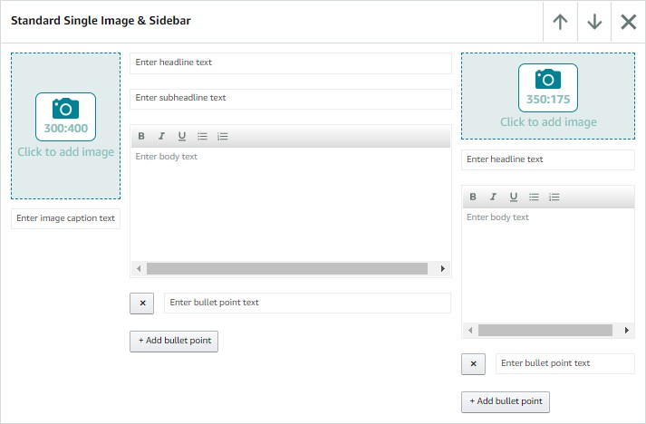

 **Fields**

| Component in editor | Block property in JSON | Component property in JSON | Required | Values |
|----------|----------|----------|----------|----------|
| Main headline text | n/a | headline | Yes | maxLength: 160 |
| Main sub-headline text | descriptionTextBlock | headline | Yes | maxLength: 200 |
| Main body text | descriptionTextBlock | body | Yes | maxLength: 500 |
| Main bullet point | descriptionListBlock | textList | No | maxLength: 200 |
| Main image | imageCaptionBlock | image | Yes | Minimum image size: 300 x 400 pixels |
| Main image alt text | imageCaptionBlock | image | Yes | maxLength: 100 |
| Main image caption text | imageCaptionBlock | caption | Yes | maxLength: 200 |
| Sidebar headline | sidebarImageTextBlock | headline | No | maxLength: 200 |
| Sidebar body text | sidebarImageTextBlock | body | No | maxLength: 500 |
| Sidebar bullet point | sidebarListBlock | textList | No | maxLength: 200 |
| Sidebar image | sidebarImageTextBlock | image | Yes | Minimum image size: 300 x 175 pixels |
| Sidebar image alt text | sidebarImageTextBlock | image | Yes | maxLength: 100 |

### StandardSingleSideImageModule

**Rendered**


**Editor**


**Fields**

| Component in editor | Block property in JSON | Component property in JSON | Required | Values                                   |
|---------------------|------------------------|----------------------------|----------|------------------------------------------|
| Image position      | n/a                    | imagePositionType          | Yes      | LEFT - Image is on the left (as in this  example) RIGHT - Image is on the right. |
| Main headline text  | block                  | headline                   | No       | maxLength: 160                           |
| Main body text      | block                  | body                       | No       | maxLength: 1000                          |
| Main Image          | block                  | image                      | Yes      | Minimum image size: 300 x 300 pixels     |
| Main image alt text | block                  | image                      | Yes      | maxLength: 100                           |

### StandardFourImageTextModule

**Rendered**

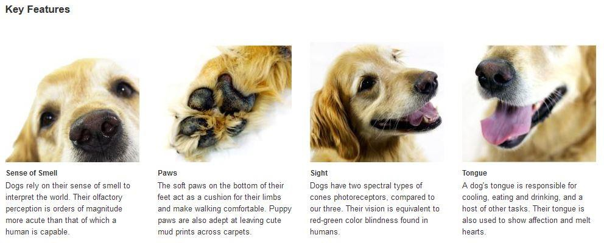

**Editor**

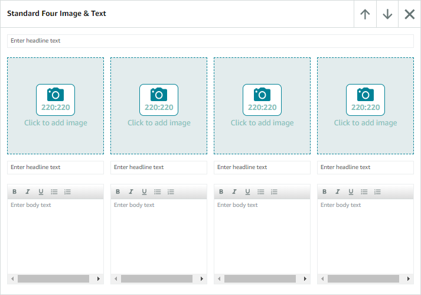

**Fields**

| Component in editor          | Block property in JSON | Component property in JSON | Required | Values                        |
| ---------------------------- | ---------------------- | -------------------------- | -------- | ----------------------------- |
| Main headline text           | n/a                    | headline                   | No       | maxLength: 200                |
| Headline text in blocks 1-4  | block{1-4}             | headline                   | No       | maxLength: 160                |
| Body text in blocks 1-4      | block{1-4}             | body                       | No       | maxLength: 1000               |
| Image in blocks 1-4          | block{1-4}             | image                      | Yes      | Minimum image size: 220 x 200 |
| Image alt text in blocks 1-4 | block{1-4}             | image                      | No       | maxLength: 100                |

### StandardComparisonTableModule

 **Rendered**

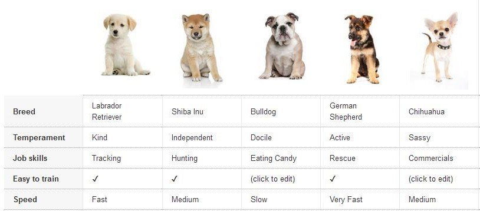

**Editor**


 **Fields**

| Component in editor            | Block property in JSON | Component property in JSON | Required | Values                                   |
|--------------------------------|------------------------|----------------------------|----------|------------------------------------------|
| Metric name                    | n/a                    | metricRowLabel             | No       | maxLength: 100                           |
| Title in blocks 1-6            | productColumns         | title                      | No       | maxLength: 80                            |
| ASIN in blocks 1-6             | productColumns         | asin                       | No       | maxLength: 10                            |
| Highlight column in blocks 1-6 | productColumns         | highlight                  | Yes      | true = Highlighted <br>false = Not highlighted |
| Image in blocks 1-6            | productColumns         | image                      | No       | Minimum image size: 150 x 300 pixels     |
| Image alt text in blocks 1-6   | productColumns         | image                      | No       | maxLength: 100                           |
| Column Position in blocks 1-6  | productColumns:array   | position                   | No       | Min= 1 (first) <br>Max=6 (last)          |
| Metric text in blocks 1-6      | productColumns         | metric                     | No       | maxLength: 250                           |

### StandardMultipleImageTextModule

**Rendered**


**Editor**

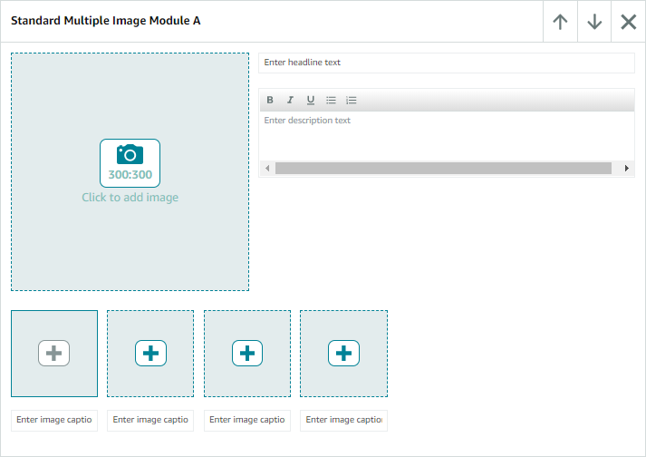

**Fields**

| Component in editor                      | Block property in JSON | Component property in JSON | Required | Values                               |
|------------------------------------------|------------------------|----------------------------|----------|--------------------------------------|
| Highlight Image (Note: Thumbnail generated automatically from highlight image) | blocks                 | image                      | Yes      | Minimum image size: 300 x 300 pixels |
| Image alt text                           | blocks                 | image                      | No       | maxLength: 100                       |
| Headline Text                            | blocks                 | headline                   | No       | maxLength: 160                       |
| Description Text                         | blocks                 | body                       | No       | maxLength: 1000                      |
| Caption Text                             | blocks                 | caption                    | No       | maxLength: 200                       |


### StandardSingleImageSpecsDetailModule

**Rendered**

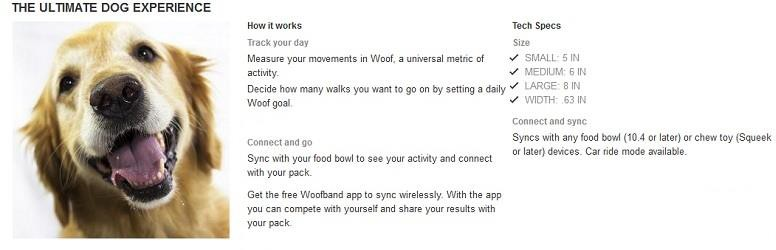

**Editor**

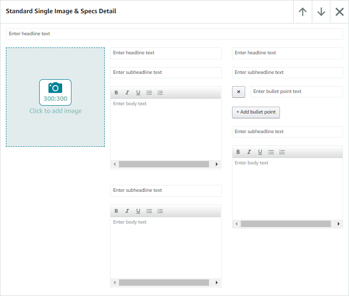

**Fields**

| Component in editor     | Block property in JSON | Component property in JSON | Required | Values                                                       |
| ----------------------- | ---------------------- | -------------------------- | -------- | ------------------------------------------------------------ |
| Headline text           | n/a                    | headline                   | No       | maxLength: 200                                               |
| Headline description    | n/a                    | descriptionHeadline        | No       | maxLength: 160                                               |
| Main image              | n/a                    | image                      | Yes      | Minimum image size: 300 x 300 pixels                         |
| Main Image alt text     | n/a                    | image                      | No       | maxLength: 100                                               |
| Subheadline description | descriptionBlock       | headline                   | No       | maxLength: 200                                               |
| Body text description   | descriptionBlock       | body                       | Yes      | maxLength: 400                                               |
| Headline tech specs     | n/a                    | specificationHeadline      | No       | maxLength: 160                                               |
| Subheadline tech specs  | specificationListBlock | headline                   | No       | maxLength: 200                                               |
| Bullet Point tech specs | specificationListBlock | textList                   | No       | maxLength: 200 Min position=1 (first)<br>Max position=8 (last) |
| Subheadline tech specs  | specificationTextBlock | headline                   | No       | maxLength: 200                                               |
| body text tech specs    | specificationTextBlock | body                       | Yes      | maxLength: 1000                                              |

### StandardSingleImageHighlightsModule

**Rendered**


**Editor**


**Fields**

| Component in editor       | Block property in JSON | Component property in JSON | Required | Values                                                       |
| ------------------------- | ---------------------- | -------------------------- | -------- | ------------------------------------------------------------ |
| Main image                | n/a                    | image                      | Yes      | Minimum image size: 300 x 300 pixels                         |
| Image alt text            | n/a                    | image                      | Yes      | maxLength: 100                                               |
| Headline description      | n/a                    | headline                   | No       | maxLength: 160                                               |
| Subheadline 1 description | textBlock1             | headline                   | No       | maxLength: 200                                               |
| Body text 1 description   | textBlock1             | body                       | No       | maxLength: 1000                                              |
| Subheadline 2 description | textBlock2             | headline                   | Yes      | maxLength: 200                                               |
| Body text 2 description   | textBlock2             | body                       | Yes      | maxLength: 400                                               |
| Subheadline 3 description | textBlock3             | headline                   | Yes      | maxLength: 200                                               |
| Body text 3 description   | textBlock3             | body                       | Yes      | maxLength: 400                                               |
| Headline tech specs       | bulletedListBlock      | headline                   | Yes      | maxLength: 160                                               |
| Bullet Point tech specs   | bulletedListBlock      | textList                   | Yes      | maxLength: 100 Min position=1 (first)<br>Max position=8 (last) |

### StandardThreeImageTextModule

**Rendered**

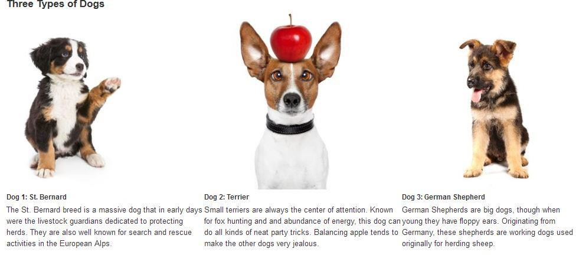

**Editor**

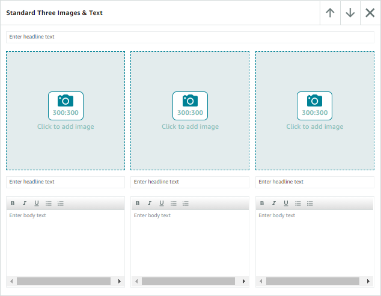

**Fields**

| Component in editor | Block property in JSON | Component property in JSON | Required | Values                               |
|---------------------|------------------------|----------------------------|----------|--------------------------------------|
| Main headline Text  | n/a                    | headline                   | Yes      | maxLength: 200                       |
| Headline            | block{1-3}             | headline                   | Yes      | maxLength: 160                       |
| Image               | block{1-3}             | image                      | Yes      | Minimum image size: 300 x 300 pixels |
| Image alt text      | block{1-3}             | image                      | Yes      | maxLength: 100                       |
| Body text           | block{1-3}             | body                       | Yes      | maxLength: 1000                      |

### StandardFourImageTextQuadrantModule

**Rendered**


**Editor**


**Fields**

| Component in editor | Block property in JSON | Component property in JSON | Required | Values                               |
|---------------------|------------------------|----------------------------|----------|--------------------------------------|
| Image               | block{1-4}             | image                      | Yes      | Minimum image size: 135 x 135 pixels |
| Image alt text      | block{1-4}             | image                      | Yes      | maxLength: 100                       |
| Headline            | block{1-4}             | headline                   | Yes      | maxLength: 160                       |
| Body text           | block{1-4}             | body                       | Yes      | maxLength: 1000                      |

### StandardImageTextOverlayModule

**Rendered**


**Editor**


**Fields**

| Component in editor | Block property in JSON | Component property in JSON | Required | Values                                                       |
| ------------------- | ---------------------- | -------------------------- | -------- | ------------------------------------------------------------ |
| Overlay color type  | n/a                    | overlayColorType           | Yes      | DARK - Dark, semi-opaque background (as in this example) <br>LIGHT - White, semi-opaque background |
| Image               | block                  | image                      | Yes      | Minimum image size: 970 x 300 pixels                         |
| Image alt text      | block                  | image                      | Yes      | maxLength: 100                                               |
| Headline text       | block                  | headline                   | No       | maxLength: 70                                                |
| Body text           | block                  | body                       | No       | maxLength: 300                                               |

### StandardTextModule

**Rendered**

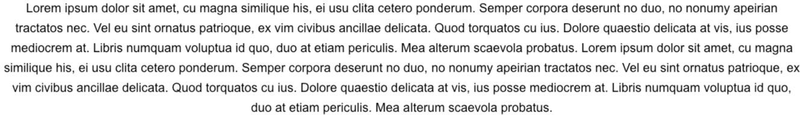

**Editor**

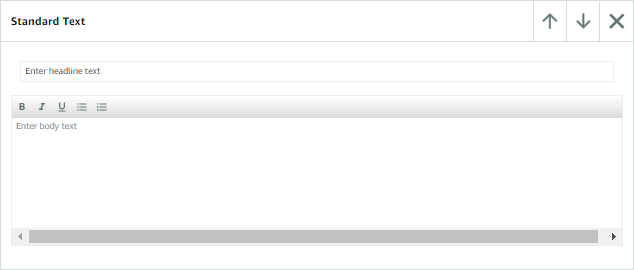

**Fields**

| Component in editor | Block property in JSON | Component property in JSON | Required | Values          |
|---------------------|------------------------|----------------------------|----------|-----------------|
| Headline text       | n/a                    | headline                   | No       | maxLength: 160  |
| Body text           | n/a                    | body                       | No       | maxLength: 5000 |

### StandardProductDescriptionModule

**Rendered**

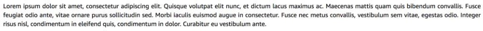

**Editor**


**Fields**

| Component in editor | Block property in JSON | Component property in JSON | Required | Values          |
|---------------------|------------------------|----------------------------|----------|-----------------|
| Body text           | n/a                    | body                       | No       | maxLength: 6000 |

### StandardTechSpecsModule

**Rendered**

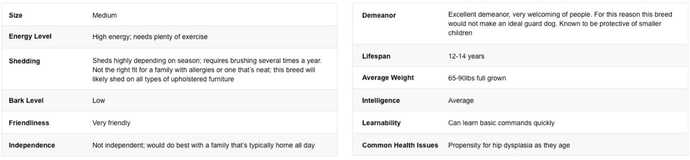

**Editor**

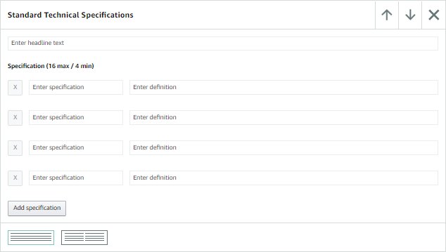

**Fields**

| Component in editor                      | Block property in JSON | Component property in JSON | Required | Values                                   |
|------------------------------------------|------------------------|----------------------------|----------|------------------------------------------|
| Main headline                            | n/a                    | headline                   | Yes      | maxLength: 80                            |
| Spec Name (Min 4 / Max 16)               | specificationList      | label                      | Yes      | maxLength: 30                            |
| Spec definition (Min 4 / Max 16)         | specificationList      | description                | Yes      | maxLength: 500                           |
| Table count (display specs in one table or two tables side-by- side) | n/a                    | tableCount                 | Yes      | 1 = one table<br>2 = two tables side by side |

### StandardCompanyLogoModule

**Rendered**


**Editor**

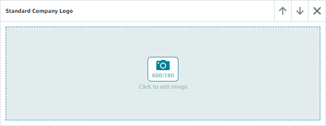

**Fields**

| Component in editor | Block property in JSON | Component property in JSON | Required | Values                               |
|---------------------|------------------------|----------------------------|----------|--------------------------------------|
| Image               | n/a                    | companyLogo                | Yes      | Minimum image size: 600 x 180 pixels |
| Image alt text      | n/a                    | companyLogo                | Yes      | maxLength: 100                       |


### StandardHeaderImageTextModule

**Rendered**

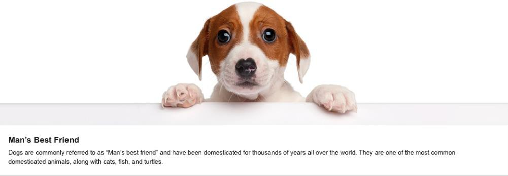

**Editor**


**Fields**

| Component in editor | Block property in JSON | Component property in JSON | Required | Values                               |
|---------------------|------------------------|----------------------------|----------|--------------------------------------|
| Headline            | n/a                    | headline                   | No       | maxLength: 150                       |
| Subheadline         | block                  | headline                   | No       | maxLength: 150                       |
| Body text           | block                  | body                       | No       | maxLength: 6000                      |
| Image               | block                  | image                      | Yes      | Minimum image size: 970 x 600 pixels |
| Image alt text      | block                  | image                      | No       | maxLength: 100                       |

